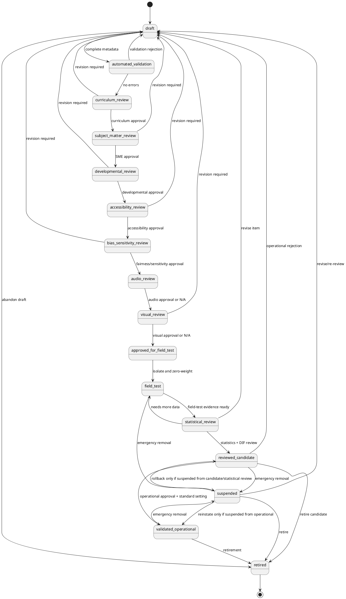

# Assessment Item Governance and Validation Standard v1

Status: **provisional governance standard**. This document and its companion JSON standard define a workflow state machine, review roles, evidence requirements, versioning rules, suspension/retirement controls, and validation checks for future assessment items. They are not item banks, runtime APIs, or psychometric validation by themselves.

Companion machine-readable standard: `curriculum-framework/assessment/item-governance.v1.json`.

## 1. Core distinctions

The governance standard distinguishes **workflow state** from **operational item status**.

- `workflow_state` describes where a specific item version is in the review lifecycle.
- `item_status` is the canonical eligibility label consumed by assessment frameworks and blueprints.
- `reviewed_candidate` is not equivalent to `validated_operational`.
- Field-test items have zero decision weight.
- No item becomes `validated_operational` automatically.
- Operational mastery use requires `validated_operational` status and standard-setting dependency satisfaction.

The canonical item-status vocabulary remains aligned with the accepted assessment framework:

- `instruction_only`
- `practice`
- `progress_monitoring_candidate`
- `diagnostic_candidate`
- `mastery_candidate`
- `field_test`
- `reviewed_candidate`
- `validated_operational`
- `suspended`
- `retired`

The workflow states are:

- `draft`
- `automated_validation`
- `curriculum_review`
- `subject_matter_review`
- `developmental_review`
- `accessibility_review`
- `bias_sensitivity_review`
- `audio_review`
- `visual_review`
- `approved_for_field_test`
- `field_test`
- `statistical_review`
- `reviewed_candidate`
- `validated_operational`
- `suspended`
- `retired`

## 2. Governance state machine



## 3. Allowed transitions and evidence

Each transition must be recorded in immutable audit history with actor, role, timestamp, item version, policy version, source state, target state, item-status before/after, evidence, and reason.

Key transition requirements:

1. `draft` to `automated_validation` requires complete metadata, public/private classification, and an author change entry.
2. `automated_validation` to `curriculum_review` requires no validation errors and triaged warnings.
3. `curriculum_review` to `subject_matter_review` requires package, grade, domain, construct, and blueprint alignment evidence.
4. `subject_matter_review` to `developmental_review` requires correctness approval, distractor misconception approval, and no-trick-wording approval.
5. `developmental_review` to `accessibility_review` requires age-appropriate language and reading-load approval.
6. `accessibility_review` to `bias_sensitivity_review` requires modality-equivalence and accommodation-behavior approval.
7. `bias_sensitivity_review` to `audio_review` requires fairness/sensitivity approval and unrelated-cultural-knowledge review.
8. `audio_review` to `visual_review` requires audio non-disclosure approval or a not-applicable rationale.
9. `visual_review` to `approved_for_field_test` requires visual non-disclosure approval or a not-applicable rationale.
10. `approved_for_field_test` to `field_test` requires field-test isolation and zero-decision-weight confirmation.
11. `field_test` to `statistical_review` requires field-test evidence and administration policy snapshots.
12. `statistical_review` to `reviewed_candidate` requires item statistics, fairness review, differential-item-functioning review, and psychometric recommendation.
13. `reviewed_candidate` to `validated_operational` requires explicit operational approval and standard-setting dependency satisfaction.

Rejection loops return items to `draft`, `field_test`, or another governed review state depending on defect type. Revisions must preserve audit history and, when material, create a new item version.

## 4. Required reviewer roles and separation of duties

Required roles include:

- author
- automated validator
- curriculum reviewer
- subject-matter reviewer
- developmental reviewer
- accessibility reviewer
- bias/sensitivity reviewer
- audio reviewer
- visual reviewer
- psychometric reviewer
- operational approver
- governance administrator

Separation-of-duties rules:

- The author cannot be the sole approver for any required review.
- The psychometric reviewer must be distinct from the author.
- The operational approver must be distinct from the author.
- Accessibility behavior changes require accessibility review.
- Emergency removal requires post-hoc independent review.

Approval quorum is required for field-test approval, operational validation, and suspension release. Operational validation requires psychometric review, curriculum review, subject-matter review, and operational approval.

## 5. Field-test isolation and operational approval

Field-test items:

- use `item_status = field_test`
- contribute zero weight to mastery, readiness, recommendations, placement, and parent-facing decisions
- may be used for item-statistics collection
- must not appear as scored evidence in operational mastery decisions
- must not become operational automatically

The route from `field_test` to `validated_operational` must pass through `statistical_review` and `reviewed_candidate`. A field-tested item may become a reviewed candidate only after statistical, fairness, and differential-item-functioning review. It may become operational only after explicit operational approval and standard-setting dependency satisfaction.

## 6. Statistical approval, fairness, and DIF review

Statistical approval requires:

- field-test sample description
- difficulty estimate
- discrimination or model-fit evidence
- omitted/not-reached analysis
- fairness and differential-item-functioning review
- psychometric recommendation
- standard-setting dependency resolution before operational mastery use

A statistical recommendation is necessary but not sufficient. No item becomes `validated_operational` automatically after statistical review.

## 7. Versioning and material changes

Historical administrations retain the exact item version, scoring/rubric version, blueprint version, and governance policy version used at administration time.

Material changes usually require a new item version and controlled review. Material changes include changes to:

- scoring key
- rubric
- construct
- stimulus meaning
- prompt semantic meaning
- distractor meaning
- accessibility behavior
- audio behavior that changes evidence
- visual target or visual meaning
- legal/license provenance affecting delivery rights

Non-material changes may retain the version only with reviewer sign-off and an audit entry explaining why historical evidence remains comparable. Examples include typo corrections that do not change meaning and metadata formatting corrections.

## 8. Suspension, emergency removal, rollback, and retirement

Suspension triggers include:

- scoring-key defect
- rubric ambiguity
- content inaccuracy
- construct misalignment
- accessibility failure
- bias or sensitivity concern
- answer exposure
- statistical drift
- security compromise
- duplicate operational item conflict
- legal or licensing issue

Emergency removal may move `field_test`, `reviewed_candidate`, or `validated_operational` items to `suspended` for future delivery. It must not rewrite historical administration records.

Rollback restores the last approved item or policy version for future administrations only. Past administrations retain their original snapshots. A suspended field-test item cannot use rollback to bypass statistical review; reinstatement to `validated_operational` is allowed only for an item that was already `validated_operational` before suspension.

Retirement is required when content is obsolete, invalid, overexposed, unrecoverably biased, replaced by stronger coverage, or no longer aligned to curriculum/package standards. Retired items do not return to operational use without a new version and a full governance path.

## 9. Public/private data separation in governance

Governance records may reference public item-delivery metadata, but protected scoring and statistical details must remain outside public candidate indexes.

A public candidate index can include:

```json
{
  "item_id": "item-g3m-frac-compare-001",
  "version": "1.0.0",
  "package_id": "G3M_FR_001",
  "item_status": "reviewed_candidate",
  "workflow_state": "reviewed_candidate",
  "assessment_role_eligibility": ["progress_monitoring"]
}
```

A public candidate index must not include:

```json
{
  "correct_answer": "2/3",
  "rubric": {"full_credit": "Selects 2/3."},
  "distractor_rationales": ["Denominator misconception."],
  "statistical_parameters": {"difficulty": -0.2}
}
```

## 10. Representative valid governance record

```json
{
  "item_id": "item-g3m-frac-compare-001",
  "item_version": "1.0.0",
  "workflow_state": "reviewed_candidate",
  "item_status": "reviewed_candidate",
  "field_test_state": "field_test_complete",
  "statistical_state": "approved",
  "audit_history": [
    {
      "event_id": "evt-001",
      "from_state": "field_test",
      "to_state": "statistical_review",
      "role": "psychometric_reviewer",
      "policy_version": "assessment-item-governance-v1",
      "evidence": ["field-test sample", "administration snapshot"]
    },
    {
      "event_id": "evt-002",
      "from_state": "statistical_review",
      "to_state": "reviewed_candidate",
      "role": "psychometric_reviewer",
      "policy_version": "assessment-item-governance-v1",
      "evidence": ["item statistics", "DIF review", "fairness review"]
    }
  ]
}
```

This record is valid as a reviewed candidate. It is not yet valid for operational mastery use because it is not `validated_operational`.

## 11. Representative invalid governance records

### Invalid: field test promoted directly to operational

```json
{
  "from_state": "field_test",
  "to_state": "validated_operational",
  "item_status_after": "validated_operational",
  "evidence": ["teacher liked the item"]
}
```

Problems:

- It bypasses `statistical_review`.
- It bypasses `reviewed_candidate`.
- It lacks fairness and differential-item-functioning review.
- It lacks explicit operational approval and standard-setting dependency satisfaction.

### Invalid: reviewed candidate used for mastery

```json
{
  "item_id": "item-g4e-mainidea-002",
  "item_status": "reviewed_candidate",
  "assessment_use": "operational_mastery_decision"
}
```

Problem: `reviewed_candidate` is not equivalent to `validated_operational`. Operational mastery use requires `validated_operational`.

## 12. Limitations and expert-review requirements

This standard is provisional governance infrastructure. It can define allowed workflow paths and machine-checkable constraints, but it does not establish psychometric validity by itself.

Expert review is required for content validity, construct alignment, developmental appropriateness, accessibility equivalence, fairness, differential-item-functioning interpretation, standard setting, and operational approval.
